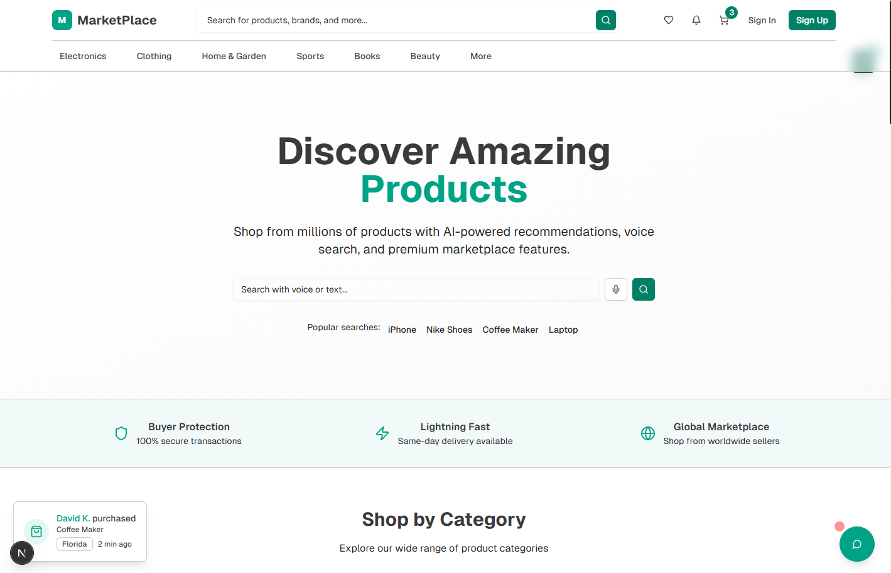
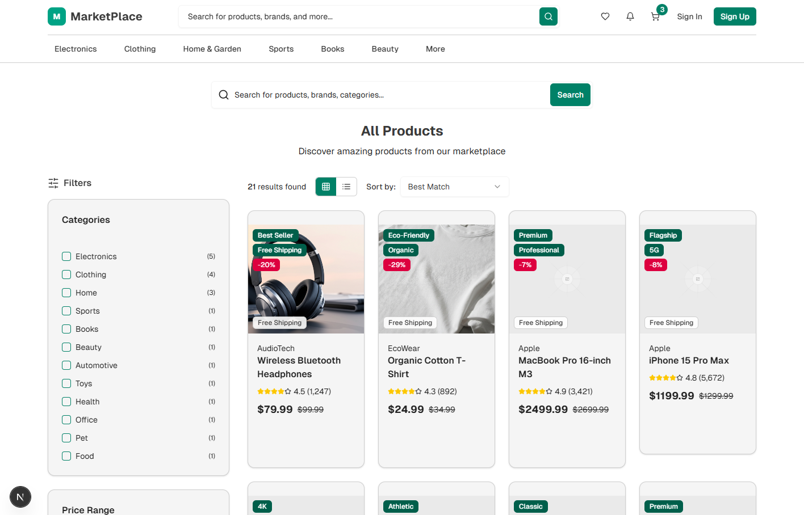

# 🛍️ Modern E-Commerce Marketplace Demo



<p align="center">
  <a href="https://ecom-marketplace-demo.netlify.app" target="_blank">
    
  </a>
</p>

A polished, high-performance **frontend showcase** of a next-generation online shopping experience.  
This project was designed to demonstrate **what your customers will see** when interacting with a modern marketplace — highlighting sleek design, smooth user flows, and premium features that can be customized for your brand.

---

## ✨ Demo Highlights

- **Beautiful Modern UI** – Clean, mobile-first layouts with responsive design across all devices.  
- **Engaging Shopping Experience** – Homepage hero, trending products, featured categories, and personalized recommendations.  
- **Smart Search & Filtering** – Intuitive product discovery with category highlights and quick-access search suggestions.  
- **Dynamic Shopping & Checkout** – Fully designed add-to-cart flow, checkout steps, and order confirmation visuals.  
- **Customer Accounts** – Profile management, order history, wishlist, and saved settings (UI demo only).  
- **Seller Dashboard** – Analytics cards, product insights, and modern chart visualizations.  
- **Premium Interactions** – Live chat widget, voice search, AI-powered recommendations, social proof banners, and notifications.  
- **Accessibility-Focused** – Semantic design tokens, WCAG-friendly color choices, and smooth interactions.  

> 💡 **Note:** This is a *non-functional frontend demo* created for client presentations.  
It visually showcases the experience of a professional marketplace without requiring a backend.

---

## 🖼️ Preview Screens

| Home / Hero | Product Grid |
|-------------|--------------|
|  |  |

---

## 🛠️ Under the Hood

While the technical stack isn’t the focus for this demo, here’s what powers the experience:

- **Framework:** Next.js 15 (App Router)  
- **Styling:** Tailwind CSS v4 with custom design tokens  
- **Icons:** Lucide React  
- **Charts & Analytics:** Recharts  
- **State:** Local React state (no backend dependencies)  
- **Hosting:** Ready for Netlify / Vercel deployment  

---

## 📂 Project Overview

```plaintext
src/
├── components/       → Reusable UI blocks (cards, forms, charts, etc.)
├── app/              → Pages & routing with Next.js App Router
├── data/             → Static JSON product & category data
└── public/           → Images, icons, and preview assets
